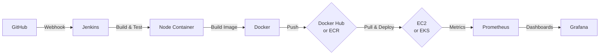

# TaskOps - Full CI/CD Pipeline with Observability

A production-ready Todo application demonstrating a complete CI/CD pipeline with observability, infrastructure as code, and Kubernetes deployment.

## 🎯 Overview

TaskOps is a Node.js Express application that showcases:

- **CI/CD Pipeline**: GitHub → Jenkins → Docker Hub/ECR → EC2/EKS
- **Observability**: Prometheus metrics via `prom-client`, Grafana dashboards
- **Infrastructure as Code**: Terraform for EKS cluster provisioning
- **Container Orchestration**: Kubernetes with Helm charts
- **Security**: Trivy vulnerability scanning

## 🏗️ Architecture



**Pipeline Flow:**
1. Code pushed to GitHub triggers webhook
2. Jenkins runs tests in Node.js container
3. Builds Docker image and tags with SHA + latest
4. Pushes to Docker Hub or AWS ECR
5. Deploys to EC2 (Docker Compose) or EKS (Helm)
6. Optional: Installs Prometheus/Grafana for monitoring
7. Runs smoke tests to verify deployment

## ✨ Features

### API Endpoints

- `GET /healthz` - Health check endpoint
- `GET /metrics` - Prometheus metrics endpoint
- `GET /api/todos` - List all todos
- `GET /api/todos/:id` - Get a todo by ID
- `POST /api/todos` - Create a todo (`{ text: string }`)
- `PUT /api/todos/:id` - Update a todo (`{ text?: string, done?: boolean }`)
- `DELETE /api/todos/:id` - Delete a todo

### Prometheus Metrics

- `http_requests_total{method, route, status}` - Total HTTP requests counter
- `http_request_duration_seconds{method, route, status}` - Request duration histogram
- Default Node.js metrics (CPU, memory, etc.)

## 📁 Project Structure

```
TaskOps/
├── src/
│   ├── app.js                # Express app with metrics
│   ├── server.js             # Server entry point
│   ├── routes/
│   │   └── todos.js          # API routes
│   ├── controllers/
│   │   └── todosController.js
│   ├── services/
│   │   └── todosService.js   # In-memory storage
│   └── middleware/
│       └── errorHandler.js
├── tests/
│   ├── healthz.test.js       # Health check tests
│   ├── metrics.test.js       # Metrics endpoint tests
│   └── todos.test.js         # CRUD tests
├── public/
│   └── index.html            # Landing page
├── charts/taskops/
│   ├── Chart.yaml
│   ├── values.yaml
│   └── templates/
│       ├── deployment.yaml
│       ├── service.yaml
│       └── servicemonitor.yaml
├── deploy/ec2/
│   ├── docker-compose.yml    # EC2 deployment
│   └── prometheus.yml        # Prometheus config
├── infra/terraform/
│   ├── versions.tf
│   ├── provider.tf
│   ├── variables.tf
│   ├── vpc.tf                # VPC configuration
│   ├── eks.tf                # EKS cluster
│   ├── ecr.tf                # ECR repository
│   ├── outputs.tf
│   └── backend.tf.example
├── .github/workflows/
│   └── trivy.yml             # Security scan
├── Dockerfile
├── docker-compose.yml        # Local dev
├── Jenkinsfile               # CI/CD pipeline
└── README.md
```

## 🚀 Quick Start

### Local Development

```bash
# Install dependencies
npm ci

# Run tests
npm test

# Start development server
npm run dev

# Open browser
open http://localhost:8000
```

### Docker

```bash
# Build image
docker build -t taskops:latest .

# Run container
docker run -d --name taskops -p 8000:8000 taskops:latest

# Health check
curl http://localhost:8000/healthz

# View metrics
curl http://localhost:8000/metrics
```

### Docker Compose (Local)

```bash
# Start application
docker-compose up -d

# View logs
docker-compose logs -f

# Stop
docker-compose down
```

## 🔄 Jenkins CI/CD Setup

### Prerequisites

1. **Jenkins Running on EC2** (or other host)
2. **Required Tools Installed**:
   - Docker
   - AWS CLI
   - kubectl
   - Helm
   - Terraform

### Jenkins Credentials

Create the following credentials in Jenkins:

1. **Docker Hub** (optional if using ECR only):
   - ID: `dockerhub-creds`
   - Type: Username with password
   - Username: `<DOCKER_HUB_USER>`
   - Password: Docker Hub password/token

2. **AWS Credentials**:
   - ID: `aws-creds`
   - Type: AWS Credentials
   - Access Key ID: Your AWS access key
   - Secret Access Key: Your AWS secret key

3. **EC2 SSH Key** (for EC2 deployment):
   - ID: `ec2-ssh`
   - Type: SSH Username with private key
   - Username: `ec2-user` (or `ubuntu`)
   - Private Key: Your EC2 private key

### Environment Variables

Set these in Jenkins → Manage Jenkins → Configure System → Global properties:

- `AWS_DEFAULT_REGION`: `ap-south-1`
- `ECR_REPO`: `<AWS_ACCOUNT_ID>.dkr.ecr.ap-south-1.amazonaws.com/taskops`
- `EC2_HOST`: `<EC2_PUBLIC_DNS_OR_IP>`
- `EC2_USER`: `ec2-user`
- `DOCKER_HUB_USER`: `<DOCKER_HUB_USER>`

### Pipeline Job Configuration

1. **Create Pipeline Job**:
   - New Item → Pipeline
   - Name: `taskops-pipeline`

2. **Configure Pipeline**:
   - Pipeline definition: Pipeline script from SCM
   - SCM: Git
   - Repository URL: Your GitHub repo URL
   - Branch: `*/main`
   - Script Path: `Jenkinsfile`

3. **GitHub Webhook**:
   - GitHub → Repository → Settings → Webhooks
   - Payload URL: `http://<JENKINS_IP>:8080/github-webhook/`
   - Content type: `application/json`
   - Events: `Just the push event`

### Pipeline Parameters

When triggering the pipeline, you can specify:

- **DEPLOY_TARGET**: `ec2` or `eks` (default: `ec2`)
- **INSTALL_MONITORING**: `true` or `false` (default: `false`)

### Pipeline Stages

1. **Checkout** - Clone repository
2. **Node Tests** - Run tests in `node:18-alpine` container
3. **Docker Build & Tag** - Build image with `latest` and SHA tags
4. **Login & Push** - Push to Docker Hub or ECR based on deploy target
5. **Deploy**:
   - **EC2**: Copy docker-compose.yml, pull image, deploy via Docker Compose
   - **EKS**: Apply Terraform, update kubeconfig, install Helm chart
6. **Smoke Tests** - Verify deployment with health checks

## ☸️ Kubernetes Deployment (EKS)

### Prerequisites

- AWS CLI configured
- kubectl installed
- Helm installed
- Terraform >= 1.6

### Deploy with Terraform

```bash
cd infra/terraform

# Initialize Terraform
terraform init

# Review plan
terraform plan

# Apply (creates VPC, EKS, ECR)
terraform apply -auto-approve

# Get outputs
terraform output
```

### Configure kubectl

```bash
# Update kubeconfig
aws eks update-kubeconfig --region ap-south-1 --name taskops-eks

# Verify connection
kubectl get nodes
```

### Deploy with Helm

```bash
# Build and push image to ECR first
aws ecr get-login-password --region ap-south-1 | \
  docker login --username AWS --password-stdin <AWS_ACCOUNT_ID>.dkr.ecr.ap-south-1.amazonaws.com

docker build -t <ECR_REPO_URI>:latest .
docker tag <ECR_REPO_URI>:latest <ECR_REPO_URI>:latest
docker push <ECR_REPO_URI>:latest

# Install Helm chart
helm upgrade --install taskops charts/taskops \
  --namespace taskops --create-namespace \
  --set image.repository=<ECR_REPO_URI> \
  --set image.tag=latest \
  --set service.type=LoadBalancer \
  --wait --timeout 5m

# Check deployment
kubectl get pods -n taskops
kubectl get svc -n taskops
```

### Access Application

```bash
# Get LoadBalancer hostname
kubectl get svc taskops -n taskops -o jsonpath='{.status.loadBalancer.ingress[0].hostname}'

# Or use port-forward
kubectl port-forward -n taskops svc/taskops 8000:8000

# Test
curl http://localhost:8000/healthz
```

### Install Monitoring Stack

```bash
# Add Prometheus Helm repo
helm repo add prometheus-community https://prometheus-community.github.io/helm-charts
helm repo update

# Install kube-prometheus-stack
helm upgrade --install prometheus prometheus-community/kube-prometheus-stack \
  --namespace monitoring --create-namespace \
  --wait --timeout 5m

# Access Grafana
kubectl port-forward -n monitoring svc/prometheus-grafana 3000:80

# Get admin password
kubectl get secret prometheus-grafana -n monitoring -o jsonpath='{.data.admin-password}' | base64 -d
```

## 🖥️ EC2 Deployment

### Prerequisites

- EC2 instance with Docker installed
- SSH access configured

### Deploy via Jenkins

1. Set `DEPLOY_TARGET` parameter to `ec2`
2. Ensure `EC2_HOST` and `EC2_USER` are set in Jenkins environment
3. Run pipeline

### Manual Deployment

```bash
# Copy docker-compose.yml to EC2
scp deploy/ec2/docker-compose.yml ec2-user@<EC2_HOST>:/tmp/

# SSH to EC2
ssh ec2-user@<EC2_HOST>

# Login to Docker registry
docker login -u <DOCKER_HUB_USER>

# Pull and run
export TASKOPS_IMAGE=<DOCKER_HUB_USER>/taskops:latest
docker compose -f /tmp/docker-compose.yml up -d

# Check logs
docker compose -f /tmp/docker-compose.yml logs -f
```

### With Monitoring (Prometheus + Grafana)

```bash
# Start with monitoring profile
docker compose -f /tmp/docker-compose.yml --profile monitoring up -d

# Access Prometheus
open http://<EC2_HOST>:9090

# Access Grafana
open http://<EC2_HOST>:3000
# Login: admin/admin
```

## 📊 Observability

### Prometheus Metrics

The application exposes Prometheus metrics at `/metrics`:

- `http_requests_total` - Total HTTP requests by method, route, and status
- `http_request_duration_seconds` - Request duration histogram
- Node.js default metrics (CPU, memory, etc.)

### Grafana Dashboards

**For Docker Compose (EC2):**
- Prometheus: http://<EC2_HOST>:9090
- Grafana: http://<EC2_HOST>:3000 (admin/admin)

**For Kubernetes (EKS):**
- Prometheus: `kubectl port-forward -n monitoring svc/prometheus-kube-prometheus-prometheus 9090:9090`
- Grafana: `kubectl port-forward -n monitoring svc/prometheus-grafana 3000:80`

### ServiceMonitor (Kubernetes)

The Helm chart includes a ServiceMonitor resource for Prometheus Operator to automatically discover and scrape metrics.

## 🔒 Security

### Trivy Scanning

**Local:**
```bash
# Scan Docker image
trivy image taskops:latest

# Scan Dockerfile
trivy fs .

# Scan remote image
trivy image <DOCKER_HUB_USER>/taskops:latest
```

**GitHub Actions:**
The `.github/workflows/trivy.yml` workflow automatically scans images on push/PR.

### Secrets Management

**Never commit secrets!** Use Jenkins credentials:

- Docker Hub credentials → Jenkins credentials
- AWS credentials → Jenkins credentials
- SSH keys → Jenkins credentials

Placeholders in code:
- `<DOCKER_HUB_USER>` - Replace with your Docker Hub username
- `<AWS_ACCOUNT_ID>` - Replace with your AWS account ID
- `<ECR_REPO_URI>` - Replace with ECR repository URL
- `<EC2_PUBLIC_DNS_OR_IP>` - Replace with EC2 hostname/IP
- `<JENKINS_CRED_ID:aws-creds>` - Replace with actual Jenkins credential ID

## 🧪 Testing

### Run Tests

```bash
# Run all tests
npm test

# Run specific test file
npm test -- tests/healthz.test.js

# Run with coverage
npm test -- --coverage
```

### Test Coverage

- `tests/healthz.test.js` - Health check endpoint
- `tests/metrics.test.js` - Prometheus metrics endpoint
- `tests/todos.test.js` - CRUD operations

## 📝 Runbook

### Common Commands

**Local Development:**
```bash
npm ci && npm run dev
```

**Docker:**
```bash
docker build -t taskops:latest .
docker run -d --name taskops -p 8000:8000 taskops:latest
```

**Kubernetes:**
```bash
kubectl apply -f k8s/
kubectl port-forward svc/taskops 8000:8000
```

**Terraform:**
```bash
cd infra/terraform
terraform init
terraform plan
terraform apply
```

**Helm:**
```bash
helm template charts/taskops
helm install taskops charts/taskops --namespace taskops --create-namespace
```

**Trivy:**
```bash
trivy image taskops:latest
```

### Troubleshooting

**Jenkins Pipeline Fails:**
- Check Docker daemon is running
- Verify credentials are correct
- Check AWS permissions for ECR access
- Ensure kubectl/helm are installed

**Kubernetes Pod Not Starting:**
```bash
kubectl describe pod <pod-name> -n taskops
kubectl logs <pod-name> -n taskops
```

**EC2 Deployment Issues:**
- Verify SSH key is correct
- Check Docker is installed on EC2
- Ensure ports 8000, 9090, 3000 are open in security group

**Metrics Not Scraping:**
- Verify ServiceMonitor is created: `kubectl get servicemonitor -n taskops`
- Check Prometheus targets: Prometheus UI → Status → Targets

## 📄 License

MIT

## 🙏 Acknowledgments

Built as a comprehensive DevOps demonstration project showcasing:
- CI/CD pipelines (Jenkins)
- Container orchestration (Kubernetes + Helm)
- Infrastructure as Code (Terraform)
- Observability (Prometheus + Grafana)
- Security scanning (Trivy)
- Best practices for Node.js applications

---

**Happy DevOps! 🚀**
